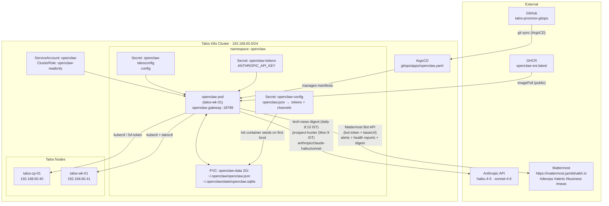

# openclaw Architecture

## Cron → Model Routing

| Cron | Schedule | Model | Delivery |
|---|---|---|---|
| cluster-health-check | every 1h | command | Mattermost #devops |
| critical-alert-check | every 15m | command | Mattermost #devops |
| argocd-sync-check | every 30m | command | Mattermost #devops |
| incident-correlator | every 30m | `anthropic/claude-haiku-4-5-20251001` | Mattermost #devops (silent when clean) |
| capacity-forecast | Mon 8:00 IST | `anthropic/claude-haiku-4-5-20251001` | Mattermost #devops |
| paas-health-check | every 10m | command | Mattermost #devops (quiet mode: degradation only) |
| bpl-health-check | every 10m | command | Mattermost #devops (quiet mode: bpl-prod degradation only) |
| talos-health-check | every 1h | legacy path (disabled) | Mattermost #devops |
| prospect-hunter | Mon 9:00 IST | `anthropic/claude-sonnet-4-6` | Mattermost #business (disabled) |

## Secret Inventory (imperative — never in git)

| Secret | Namespace | Contents |
|---|---|---|
| `openclaw-config` | openclaw | Full `openclaw.json` — gateway token, Mattermost token, model config |
| `openclaw-tokens` | openclaw | `ANTHROPIC_API_KEY` (required), `GEMINI_API_KEY` (optional legacy) |
| `openclaw-talosconfig` | openclaw | `talosconfig` file for talosctl |

Local copies with real values → `secrets/openclaw/` (gitignored).
